# Biomorphs

## Alpiner

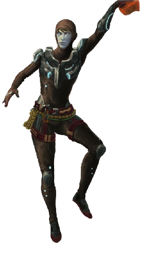

Alpiners were common in the early days of the Martian frontier, when temperatures and atmospheric pressure had not yet risen to present levels. Now they are favored by avid rock climbers, those living at high altitudes atop Mars’s shield volcanoes, and outdoor types who must endure more harsh and rugged conditions. Alpiners are also vogue among chic urbanites going for a rough-and-ready look without sleeving the more de classe ruster morph.

<blockquote class="indent stat-list">

### Alpiner

- **Cost:** 4&nbsp;MP • **Avail:** 50 (70 on Mars)

---

- **WT:** 8 • **DUR:** 40 • **DR:** 60
- **Insight** 0, **Moxie** 0, **Vigor** 1, **Flex** 2

---

- **Movement Rate:** Walker 4/20
- **Ware:** Biomods, Cold Tolerance, Cortical Stack, Enhanced Respiration, Grip Pads, Mesh Inserts, Oxygen Reserve, Vacuum Sealing
- **Common Extras:** Direction Sense, Radiation Sense, Respirocytes. Many have the Planned Obsolescence trait.

</blockquote>

## Aquanaut

Aquanauts are environmentally adapted for underwater activities while still functional on land. Their heart rate slows while submerged, their skin includes a layer of blubber that retains heat, they store oxygen in their muscle tissue, and they do not suffer negative health effects from pressure changes. Additionally, their eyes have nictitating membranes and their corneas adjust to counter underwater refraction. Their hands and feet are webbed and they possess a transgenic swim bladder for controlling buoyancy. They can safely descend to about 200 meters depth (roughly 21 atmospheres of pressure at 1 g); deeper requires the pressure adaptation mod.

<blockquote class="indent stat-list">

### Aquanaut

- **Cost:** 3&nbsp;MP • **Avail:** 20 (90 in aquatic habs)

---

- **WT:** 7 • **DUR:** 35 • **DR:** 53
- **Insight** 0, **Moxie** 0, **Vigor** 2, **Flex** 2

---

- **Movement Rate:** Swim 4/12, Walker 4/20
- **Ware:** Biomods, Cold Tolerance, Cortical Stack, Enhanced Respiration, Gills, Mesh Inserts, Sonar, Swim Bladder
- **Morph Traits:** Exotic Morphology (Level 1), Non-Human Biochemistry (Level 1)
- **Common Extras:** Cryogenic Protection, Oxygen Reserve, Respirocytes, Pressure Adaptation, Toxin Filters

</blockquote>

## Ariel

The surprising number of transhumans who sleeve in Titan-adapted hulder morphs encouraged designers on Profunda to develop a Titan-adapted flyer. While the sturdy hulder morph is designed for nomadic herders, the ariel morph is designed by people who wish to survive by hunting. Individuals sleeved in the ariel morph can hunt and eat Titanian caribou, but they most often eat the smaller rabbitlike creatures that Profunda designers have also recently designed to live on Titan. Ariel morphs have exotic-looking heads similar to those of hulder morphs, but they also possess sleek and streamlined humanoid bodies with four limbs and a pair of bat-like wings. These morphs have also been used by a few daring transhumans to explore the upper cloud layers of both Saturn and Uranus.

<blockquote class="indent stat-list">

### Ariel

- **Cost:** 4&nbsp;MP • **Avail:** 10 (40 on Titan)

---

- **WT:** 6 • **DUR:** 30 • **DR:** 45
- **Insight** 0, **Moxie** 0, **Vigor** 1, **Flex** 1

---

- **Movement Rate:** Walker 4/12, Winged 8/32
- **Ware:** Biomods, Bioweave, Claws, Cortical Stack, Cryogenic Protection, Direction Sense, Enhanced Hearing, Enhanced Vision, Long-Term Life Support, Mesh Inserts, Oxygen Reserve, Prehensile Feet, T-Ray Emitter, Vacuum Sealing, Wings
- **Morph Traits:** Exotic Morphology (Level 2), Non-Human Biochemistry (Level 2)
- **Common Extras:** Respirocytes

</blockquote>

## Bouncer

Bouncers are genetically adapted for microgravity. Their legs are more limber and their feet can grasp as well as their hands. They can tolerate the cold temperatures of beehive tunnels and have an oxygen reserve in case they are exposed to vacuum. Bouncers are very common in the outer system and zero-g habitats.

<blockquote class="indent stat-list">

### Bouncer

- **Cost:** 4&nbsp;MP • **Avail:** 60 (80 in micrograv habs)

---

- **WT:** 7 • **DUR:** 35 • **DR:** 53
- **Insight** 1, **Moxie** 0, **Vigor** 1, **Flex** 2

---

- **Movement Rate:** Walker 4/12
- **Ware:** Biomods, Cold Tolerance, Cortical Stack, Grip Pads, Mesh Inserts, Oxygen Reserve, Prehensile Feet
- **Morph Traits:** Limberness (Level 1)

</blockquote>

## Bruiser

This morph is made to be large, strong, and physically intimidating. Adopted early on by sports performers, it quickly became a favorite among criminal cartels and thugs. At 2.5 meters tall, a bruiser may have difficulty moving comfortably in all but the most open and uncrowded of habitats.

<blockquote class="indent stat-list">

### Bruiser

- **Cost:** 4&nbsp;MP • **Avail:** 30

---

- **WT:** 10 • **DUR:** 50 • **DR:** 75
- **Insight** 0, **Moxie** 0, **Vigor** 4, **Flex** 1

---

- **Movement Rate:** Walker 4/12
- **Ware:** Biomods, Cortical Stack, Mesh Inserts
- **Morph Traits:** Exotic Morphology (Level 1)
- **Common Extras:** Adrenal Surge, Claws, Hardened Skeleton, Medichines. Many also have the Unattractiveness (Level 1) trait.
- **Notes:** Large size

</blockquote>

## Cloud Skate

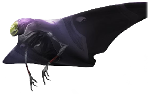

Cloud skates are exotic, specialized biomorph designs that push the edge of what is possible. They are designed to survive in the atmospheres of ice giants and gas giants, such as Uranus and Jupiter. These morphs are shaped roughly like a tailless stingray with a pair of slender arms. They can soar among the clouds for months on end, their swim bladders providing neutral buoyancy in dense atmospheres, preventing them from sinking below a safe depth.

<blockquote class="indent stat-list">

### Cloud Skate

- **Cost:** 3&nbsp;MP • **Avail:** 10 (40 at Uranus/Jupiter)

---

- **WT:** 7 • **DUR:** 35 • **DR:** 53
- **Insight** 2, **Moxie** 0, **Vigor** 1, **Flex** 0

---

- **Movement Rate:** Walker 2/8, Winged 8/32
- **Ware:** Asymmetric Sleep, Biomods, Cortical Stack, Cryogenic Protection, Direction Sense, Enhanced Vision, Hardened Skeleton, High-G Adaptation, Long-Term Life Support, Mesh Inserts, Pressure Adaptation, Radiation Sense, Swim Bladder, Wings
- **Morph Traits:** Enhanced Behavior (Serenity, Level 2), Exotic Morphology (Level 3), Non-Human Biochemistry (Level 2)
- **Common Extras:** Oxygen Reserve, T-Ray Emitter
- **Notes:** Bonus from Hardened Skeleton already incorporated

</blockquote>

## Crasher

Crashers are survival morphs — athletic and rugged designs capable of weathering harsh environments over long periods. They are the ideal biomorph for gatecrashing assignments and are popular among first-in teams. Though pricey and harder to acquire compared to other options, gatecrashers traveling to less habitable and dangerous places have found the investment worth it.

<blockquote class="indent stat-list">

### Crasher

- **Cost:** 8&nbsp;MP • **Avail:** 30 (50 at gate habs)

---

- **WT:** 8 • **DUR:** 40 • **DR:** 60
- **Insight** 1, **Moxie** 1, **Vigor** 2, **Flex** 2

---

- **Movement Rate:** Walker 4/20
- **Ware:** Biomods, Circadian Regulation, Cold Tolerance, Cortical Stack, Dermal Armor (+4/+5), Direction Sense, Efficient Metabolism, Enhanced Respiration, Enhanced Vision, Grip Pads, Medichines, Mesh Inserts, Vacuum Sealing
- **Common Extras:** Clean Metabolism, Digestive Symbiotes, Long-Term Life Support, Oxygen Reserve, Respirocytes, Toxin Filters

</blockquote>

## Dvergr

Dvergar (plural of dvergr) are biomorphs designed for comfortable operation in high-gravity environments. They feature a reinforced skeletal structure and sturdier muscle masses. They are easily identified by their slightly squat, thick-necked, tough appearances.

<blockquote class="indent stat-list">

### Dvergr

- **Cost:** 5&nbsp;MP • **Avail:** 20 (60 on high-g exoplanets)

---

- **WT:** 9 • **DUR:** 45 • **DR:** 68
- **Insight** 0, **Moxie** 0, **Vigor** 3, **Flex** 1

---

- **Movement Rate:** Walker 4/20
- **Ware:** Biomods, Cortical Stack, Hardened Skeleton, High-G Adaptation, Mesh Inserts, Muscle Augmentation
- **Notes:** Bonus from Hardened Skeleton already incorporated

</blockquote>

## Exalt

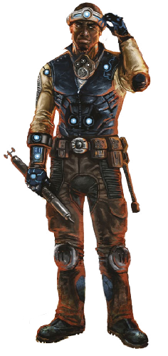

Exalts are the common, non-specialized “enhanced human” model. They are genetically upgraded to make them healthier, smarter, and more attractive (based on ever-evolving beauty standards). A modified metabolism keeps them fit and athletic for the duration of an extended lifespan.

<blockquote class="indent stat-list">

### Exalt

- **Cost:** 2&nbsp;MP • **Avail:** 70

---

- **WT:** 7 • **DUR:** 35 • **DR:** 53
- **Insight** 1, **Moxie** 1, **Vigor** 1, **Flex** 0

---

- **Movement Rate:** Walker 4/20
- **Ware:** Biomods, Cortical Stack, Mesh Inserts

</blockquote>

## Faust

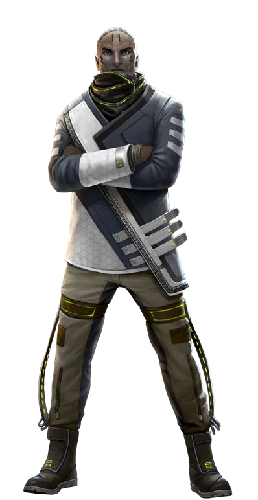

Developed in secret by a small group of unaffiliated async genehackers, this morph is not a publicly known model. It is only available to individuals who discover a connection to this unnamed, underground async network and then download the template from one of several secret mesh sites. The faust is a modified menton morph. Even under the most thorough scans, it appears to be nothing more than a mildly personalized version of that morph.

<blockquote class="indent stat-list">

### Faust

- **Cost:** 6&nbsp;MP • **Avail:** 5

---

- **WT:** 7 • **DUR:** 35 • **DR:** 53
- **Insight** 3, **Moxie** 4, **Vigor** 0, **Flex** 1

---

- **Movement Rate:** Walker 4/20
- **Ware:** Biomods, Circadian Regulation, Cortical Stack, Mesh Inserts, Mnemonics, Stress Control
- **Common Extras:** Popular add-ons include Drug Glands (Psike-Out, Nofux, TGS, Comfurt), Endocrine Control, Neuromodulation. Many also have the Psi Camouflage and/or Psi Defense traits.

</blockquote>

## Flat

Flats are baseline unmodified humans, born with all of the natural defects, hereditary diseases, and other genetic mutations that evolution so lovingly applies. Flats are increasingly rare outside bioconservative enclaves — most died off with the rest of humanity during the Fall.

<blockquote class="indent stat-list">

### Flat

- **Cost:** 0&nbsp;MP • **Avail:** 30

---

- **WT:** 6 • **DUR:** 30 • **DR:** 45
- **Insight** 0, **Moxie** 0, **Vigor** 0, **Flex** 0

---

- **Movement Rate:** Walker 4/20
- **Common Extras:** Many have the Genetic Defect trait.

</blockquote>

## Freeman

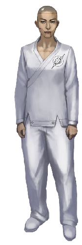

This sleeve hands tyrants the tools to ensure loyalty — or at least obedience — from their citizens. Based on simple splicers, freeman morphs are genetically and psychosurgically modified to be receptive to authority while weakening willpower and “dissident” traits. They are also genetically modified with a protein that makes their neurons sensitive to light. When combined with an optogenetics module, these neurons can be activated and deactivated remotely, enabling a monitoring muse or meshed overseer to control the ego’s behavior. Freeman morphs typically carry a monitor ALI (often a modified fork of the dictator’s muse) that watches over the ego, reports suspicious activity, and can seize physical control in an emergency. In some regimes, citizens are not informed of these implants, enabling the AIs to spy and snitch in secret. These “slave morphs” are decried or outlawed as coercive in many polities, though they are secretly deployed in remote corporate and authoritarian habitats. Surprisingly, some people voluntarily sleeve freeman morphs, preferring to hand responsibility and decision-making over to other parties, such as the Sendero Luminoso Benevolent Dictatorship habitat in the Neptunian Trojans.

<blockquote class="indent stat-list">

### Freeman

- **Cost:** 1&nbsp;MP • **Avail:** 10

---

- **WT:** 6 • **DUR:** 30 • **DR:** 45
- **Insight** 0, **Moxie** 0, **Vigor** 0, **Flex** 1

---

- **Movement Rate:** Walker 4/20
- **Ware:** Biomods, Cortical Stack, Ghostrider Module, Memory Lock, Mesh Inserts, Monitor ALI, Optogenetics Module, Puppet Sock
- **Morph Traits:** Enhanced Behavior (Obedience, Level 2), Restricted Behavior (Non-Conformity) 2, Timidity (Level 2)
- **Common Extras:** Popular add-ons include Drug Glands (Retcon) and Neuromodulation

</blockquote>

## Fury

Furies are combat morphs. These transgenic humans are upgraded for endurance, strength, reflexes, and capacity to handle physical trauma. Behavioral modifications for aggressiveness are offset by gene sequences promoting pack mentalities and cooperation, and they tend to be biologically female.

<blockquote class="indent stat-list">

### Fury

- **Cost:** 6&nbsp;MP • **Avail:** 40

---

- **WT:** 10 • **DUR:** 50 • **DR:** 75
- **Insight** 1, **Moxie** 1, **Vigor** 4, **Flex** 2

---

- **Movement Rate:** Walker 4/20
- **Ware:** Biomods, Bioweave Armor (+2/+3), Claws, Cortical Stack, Enhanced Vision, Mesh Inserts
- **Morph Traits:** Enhanced Behavior (Aggressiveness, Level 2; Cooperation, Level 2)
- **Common Extras:** Neurachem, Hardened Skeleton, Toxin Filters

</blockquote>

## Futura

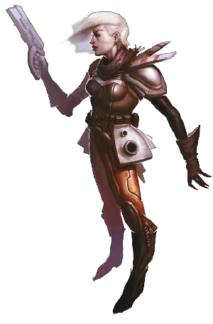

Futura morphs were specially crafted for the “Lost Generation” of accelerated-growth children. Adjusted for confidence, self-reliance, and adaptability, futuras were intended to help transhumanity regain its foothold. These programs proved disastrous and the line was discontinued, but some models and various spin-offs remain, viewed by some with distaste and others as collectibles or exotic oddities.

<blockquote class="indent stat-list">

### Futura

- **Cost:** 4&nbsp;MP • **Avail:** 25

---

- **WT:** 7 • **DUR:** 35 • **DR:** 53
- **Insight** 2, **Moxie** 4, **Vigor** 1, **Flex** 0

---

- **Movement Rate:** Walker 4/20
- **Ware:** Biomods, Cortical Stack, Mesh Inserts

</blockquote>

## Garuda

Found primarily on Luna and similar low-g worlds and habitats, this morph is adapted to fly in Earth-normal air pressure with gravity of 0.2 g or less. Garudas have light frames, with increased lung capacity. Their feathered wings extrude from the back as an extra set of limbs, leaving hands and feet unhindered during flight. Their wings may be folded behind their back or extended to a full wingspan of 3 meters.

<blockquote class="indent stat-list">

### Garuda

- **Cost:** 3&nbsp;MP • **Avail:** 30 (50 on Luna)

---

- **WT:** 6 • **DUR:** 30 • **DR:** 45
- **Insight** 1, **Moxie** 1, **Vigor** 2, **Flex** 1

---

- **Movement Rate:** Walker 4/12, Winged 8/32
- **Ware:** Biomods, Cortical Stack, Mesh Inserts, Prehensile Feet, Wings
- **Morph Traits:** Exotic Morphology (Level 1)

</blockquote>

## Ghost

Ghosts are partially designed for combat applications, but their primary focus is stealth and infiltration. Their genetic profile encourages speed, agility, and reflexes, and their minds are modified for patience and problem-solving.

<blockquote class="indent stat-list">

### Ghost

- **Cost:** 6&nbsp;MP • **Avail:** 40

---

- **WT:** 9 • **DUR:** 45 • **DR:** 68
- **Insight** 2, **Moxie** 1, **Vigor** 3, **Flex** 2

---

- **Movement Rate:** Walker 4/20
- **Ware:** Biomods, Chameleon Skin, Cortical Stack, Grip Pads, Mesh Inserts
- **Morph Traits:** Enhanced Behavior (Patience, Level 2)
- **Common Extras:** Adrenal Surge, Skinflex

</blockquote>

## Glider

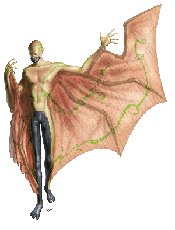

Gliders are tall and thin, with long, strong limbs and a lightweight build. Gliding membranes allow them to soar through the atmosphere in environments with thicker atmospheres and/or lower gravity. They gain altitude by riding thermals (which they see with enhanced vision).

<blockquote class="indent stat-list">

### Glider

- **Cost:** 3&nbsp;MP • **Avail:** 20

---

- **WT:** 6 • **DUR:** 30 • **DR:** 45
- **Insight** 0, **Moxie** 1, **Vigor** 1, **Flex** 1

---

- **Movement Rate:** Walker 4/12, Glider 8/32
- **Ware:** Biomods, Cortical Stack, Enhanced Respiration, Gliding Membranes, Grip Pads, Enhanced Vision, Mesh Inserts, Prehensile Feet
- **Morph Traits:** Exotic Morphology (Level 1), Limberness (Level 1)
- **Common Extras:** Respirocytes

</blockquote>

### Venusian Glider Variant

Venusian gliders are designed to survive for many hours in the middle acidic-but-habitable layers of Venus’s atmosphere.

<blockquote class="indent stat-list">

### Venusian Glider

- **Cost:** 3&nbsp;MP • **Avail:** 20 (50 on Venus)

---

- **WT:** 6 • **DUR:** 30 • **DR:** 45
- **Insight** 0, **Moxie** 1, **Vigor** 1, **Flex** 1

---

- **Movement Rate:** Walker 4/12, Glider 8/32
- **Ware:** Biomods, Cortical Stack, Enhanced Respiration, Gliding Membranes, Enhanced Vision, Mesh Inserts, Oxygen Reserve, Vacuum Sealing
- **Morph Traits:** Exotic Morphology (Level 1), Limberness (Level 1)
- **Common Extras:** Respirocytes

</blockquote>

## Grey

Originally created as part of a fad based on 20th-century images of aliens, the grey morph soon became popular with eccentric scientists and engineers. This morph’s slender and weak-looking body stands only 1.5 meters tall, short compared to modern transhumans. Its distinctive large head and eyes strike many transhumans as disturbing.

<blockquote class="indent stat-list">

### Grey

- **Cost:** 2&nbsp;MP • **Avail:** 20

---

- **WT:** 6 • **DUR:** 30 • **DR:** 45
- **Insight** 2, **Moxie** 0, **Vigor** 0, **Flex** 1

---

- **Movement Rate:** Walker 4/20
- **Ware:** Biomods, Circadian Regulation, Clean Metabolism, Cortical Stack, Mesh Inserts, Mnemonics
- **Morph Traits:** Exotic Morphology (Level 1), Unattractiveness (Level 1)

</blockquote>

## Hazer

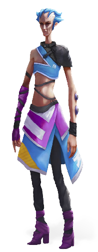

Hazers are tall but slight morphs adapted for life in Titan’s dome colonies. They cannot survive unprotected in Titan’s frigid methane environment, but they are insulated to handle a bit of cold. Some hazers have angular or elfin features that are viewed as either striking or unsettling.

<blockquote class="indent stat-list">

### Hazer

- **Cost:** 3&nbsp;MP • **Avail:** 40 (80 on Titan)

---

- **WT:** 7 • **DUR:** 35 • **DR:** 53
- **Insight** 1, **Moxie** 2, **Vigor** 0, **Flex** 1

---

- **Movement Rate:** Walker 4/20
- **Ware:** Biomods, Cold Tolerance, Cortical Stack, Mesh Inserts
- **Common Extras:** Enhanced Vision, T-Ray Emitter. Many have the Striking Looks trait.

</blockquote>

## Hibernoid

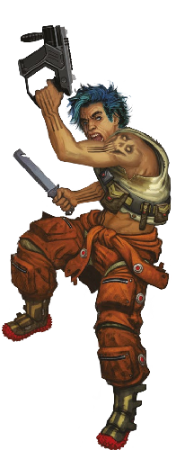

Hibernoids are transgenic-modified humans with heavily altered sleep patterns and metabolic processes. Hibernoids have a decreased need for sleep, requiring only 1–2 hours a day on average. They can also trigger a form of voluntary hibernation, effectively halting their metabolism and need for oxygen. Hibernoids make excellent long-duration space travelers, but these morphs are also favored by personal aides and hypercapitalists with non-stop lifestyles.

<blockquote class="indent stat-list">

### Hibernoid

- **Cost:** 4&nbsp;MP • **Avail:** 70

---

- **WT:** 7 • **DUR:** 35 • **DR:** 53
- **Insight** 1, **Moxie** 1, **Vigor** 0, **Flex** 2

---

- **Movement Rate:** Walker 4/20
- **Ware:** Biomods, Circadian Regulation, Clean Metabolism, Cold Tolerance, Cortical Stack, Hibernation, Mesh Inserts

</blockquote>

## Hulder

Hulder are engineered for survival in the harsh Titanian wilds and methane seas. In silhouette, their bodies resemble a longlegged great auk, though viewed up close, the resemblance to a bird ends. Instead of feathers, hulder have smooth, rubbery charcoal skin covering a thick layer of nano-augmented blubber.

<blockquote class="indent stat-list">

### Hulder

- **Cost:** 4&nbsp;MP • **Avail:** 10 (30 on Titan)

---

- **WT:** 8 • **DUR:** 40 • **DR:** 60
- **Insight** 0, **Moxie** 1, **Vigor** 1, **Flex** 1

---

- **Movement Rate:** Walker 4/20
- **Ware:** Biomods, Bioweave, Cortical Stack, Cryogenic Protection, Direction Sense, Enhanced Hearing, Enhanced Vision, Long-Term Life Support, Mesh Inserts, Oxygen Reserve, Swim Bladder, T-Ray Emitter
- **Morph Traits:** Exotic Morphology (Level 2), Non-Human Biochemistry (Level 2)
- **Common Extras:** Chem Sniffer, Digging Claws

</blockquote>

## Hyperbright

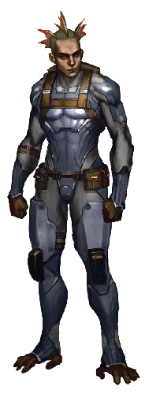

A research team on Bright created this morph to surpass the menton and push the envelope on intelligence augmentation. Hyperbrights are instantly recognizable by the brightly colored bony crests along their skulls that help to cool their brains. They are also designed for microgravity and so favored in the outer system. Many models, however, are plagued with idiosyncrasies and quirks due their advanced neurochemistry and high metabolism.

<blockquote class="indent stat-list">

### Hyperbright

- **Cost:** 4&nbsp;MP • **Avail:** 20

---

- **WT:** 7 • **DUR:** 35 • **DR:** 53
- **Insight** 5, **Moxie** 1, **Vigor** 0, **Flex** 0

---

- **Movement Rate:** Walker 4/12
- **Ware:** Biomods, Circadian Regulation, Cortical Stack, Grip Pads, Mesh Inserts, Mnemonics, Prehensile Feet
- **Morph Traits:** Exotic Morphology (Level 1), Non-Human Biochemistry (Level 1)
- **Common Extras:** Drug Glands (Comfurt), Endocrine Control, Mind Amp, Multi-Tasking, Neuromodulation, Oracles. Many have the Acumen, Addiction, and/or Fast Metabolism traits.

</blockquote>

## Imp

Shortly after the Fall, the refugees from Earth who would evolve into the scum faction struggled for resources under cramped conditions. Partying and letting off steam became an essential element of their survival. To complement this lifestyle, scum genehackers crafted morphs with the endurance to handle ragers with copious amounts of sex and drugs. These models became popular across the Solar System, particularly with “party tourists” looking to egocast into a new habitat, go on a week-long bender, and then beam back out.

<blockquote class="indent stat-list">

### Imp

- **Cost:** 5&nbsp;MP • **Avail:** 40 (80 in scum swarms)

---

- **WT:** 7 • **DUR:** 35 • **DR:** 53
- **Insight** 0, **Moxie** 2, **Vigor** 1, **Flex** 1

---

- **Movement Rate:** Walker 4/20
- **Ware:** Biomods, Circadian Regulation, Clean Metabolism, Cortical Stack, Drug Glands (Moderate Complexity drug), Enhanced Pheromones, Mesh Inserts, Scent Alteration
- **Common Extras:** Cyberbrain, Sex Switch, Toxin Filters

</blockquote>

## Menton

Mentons are genetically modified to increase cognitive abilities, particularly learning ability, creativity, attentiveness, and memory. They are favored by academics, intellectuals, scientists, and engineers.

<blockquote class="indent stat-list">

### Menton

- **Cost:** 4&nbsp;MP • **Avail:** 60

---

- **WT:** 7 • **DUR:** 35 • **DR:** 53
- **Insight** 3, **Moxie** 1, **Vigor** 1, **Flex** 1

---

- **Movement Rate:** Walker 4/20
- **Ware:** Biomods, Cortical Stack, Mesh Inserts, Mnemonics

</blockquote>

## Neotenic

Neotenics are transhumans modified to retain a child-like form. They are smaller, more agile, inquisitive, and less resource-depleting, making them ideal for habitat living and spacecraft. Some people find neotenic sleeves distasteful, especially when employed in certain media and sex work capacities, but most are designed to be neuter-gendered.

<blockquote class="indent stat-list">

### Neotenic

- **Cost:** 2&nbsp;MP • **Avail:** 50

---

- **WT:** 6 • **DUR:** 30 • **DR:** 45
- **Insight** 2, **Moxie** 1, **Vigor** 1, **Flex** 0

---

- **Movement Rate:** Walker 4/12
- **Ware:** Biomods, Circadian Regulation, Cortical Stack, Mesh Inserts
- **Morph Traits:** Exotic Morphology (Level 1)
- **Notes:** Small size

</blockquote>

## Nomad

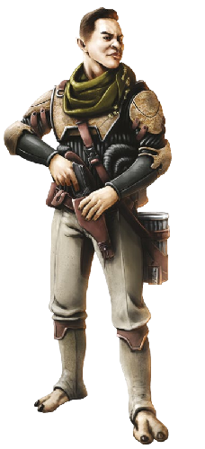

The nomad biomorph is optimized for operating in desert environments. They incorporate many transgenic traits from camels: thicker eyelashes to keep out sand, a third eyelid to dislodge grit, a complex of arteries and veins for better brain cooling, elongated noses to trap exhaled water vapor, and sometimes hooves. They carry a distributed network of fat tissue that can be relocated around their body to adapt to high or low temperatures. This tissue can be rapidly metabolized for energy and water, allowing them to survive for 1–2 months without food or water.

<blockquote class="indent stat-list">

### Nomad

- **Cost:** 3&nbsp;MP • **Avail:** 20

---

- **WT:** 7 • **DUR:** 35 • **DR:** 53
- **Insight** 0, **Moxie** 0, **Vigor** 1, **Flex** 1

---

- **Movement Rate:** Walker 4/20
- **Ware:** Biomods, Cold Tolerance, Cortical Stack, Direction Sense, Efficient Digestion, Heat Tolerance, Mesh Inserts
- **Notes:** Bodysculpting (Hooves), Respirocytes, Toxin Filters. Many have the Unattractiveness trait.

</blockquote>

## Observer

Observers are enhanced for perceptive, analytical, and investigative capabilities. They are favored by detectives, journalists, and those with an interest in details, puzzles, and thin-slicing.

<blockquote class="indent stat-list">

### Observer

- **Cost:** 4&nbsp;MP • **Avail:** 40

---

- **WT:** 7 • **DUR:** 35 • **DR:** 53
- **Insight** 2, **Moxie** 2, **Vigor** 0, **Flex** 0

---

- **Movement Rate:** Walker 4/20
- **Ware:** Biomods, Cortical Stack, Enhanced Vision, Oracles, Mesh Inserts, Mnemonics
- **Common Extras:** Enhanced Hearing, Mind Amp, Multi-Tasking, T-Ray Emitter

</blockquote>

## Olympian

Olympians are human upgrades with improved athletic capabilities like endurance, hand-eye coordination, and cardiovascular functions. Olympians are common among athletes, dancers, freerunners, gatecrashers, and soldiers.

<blockquote class="indent stat-list">

### Olympian

- **Cost:** 4&nbsp;MP • **Avail:** 60

---

- **WT:** 8 • **DUR:** 40 • **DR:** 60
- **Insight** 1, **Moxie** 1, **Vigor** 3, **Flex** 1

---

- **Movement Rate:** Walker 4/20
- **Ware:** Biomods, Cortical Stack, Mesh Inserts

</blockquote>

## Remade

The remade are completely redesigned: humans 2.0. Their cardiovascular system is stronger, their digestive tract sanitized and restructured, and they have been optimized for health, intelligence, and longevity with numerous transgenic mods. They look close to human, but are different in very noticeable and sometimes eerie ways: taller, lack of hair, slightly larger craniums, wider eyes, smaller noses, smaller teeth, and elongated digits. The remade are popular with the Ultimates faction.

<blockquote class="indent stat-list">

### Remade

- **Cost:** 7&nbsp;MP • **Avail:** 30

---

- **WT:** 9 • **DUR:** 45 • **DR:** 68
- **Insight** 2, **Moxie** 2, **Vigor** 2, **Flex** 2

---

- **Movement Rate:** Walker 4/20
- **Ware:** Biomods, Circadian Regulation, Clean Metabolism, Cold Tolerance, Cortical Stack, Enhanced Respiration, Enhanced Vision, Mesh Inserts
- **Morph Traits:** Exotic Morphology (Level 1)

</blockquote>

## Ring Flyer

Designed for soaring along the rings of Saturn, this exotic spacefaring biomorph is also found skating the magnetic fields of other gas giant, ice giant, and asteroid systems. Easily recognizable with its slender limbs and the round hump of the plasma sail on its back, this morph can survive indefinitely in space, acquiring oxygen, water, and trace organic materials from ring particles, asteroids, and small moons as needed.

<blockquote class="indent stat-list">

### Ring Flyer

- **Cost:** 5&nbsp;MP • **Avail:** 20 (40 around Saturn)

---

- **WT:** 6 • **DUR:** 30 • **DR:** 45
- **Insight** 1, **Moxie** 0, **Vigor** 0, **Flex** 2

---

- **Movement Rate:** Walker 4/12, Plasma Sail 8/40, Thrust Vector (Gas Jet) 4/12
- **Ware:** Asymmetric Sleep, Biomods, Cortical Stack, Cryogenic Protection, Enhanced Vision, Gas-Jet System, Hibernation, Long-Term Life Support, Medichines, Mesh Inserts, Oxygen Reserve, Plasma Sail, Prehensile Feet, Radiation Tolerance, T-Ray Emitter, Vacuum Sealing
- **Morph Traits:** Enhanced Behavior (Introversion, Level 2), Exotic Morphology (Level 2), Non-Human Biochemistry (Level 1)
- **Common Extras:** Respirocytes. Many have the Limberness trait.

</blockquote>

## Ruster

Adapted for survival with minimum gear in the not-fully-terraformed Martian environment, these transgenic morphs feature insulated skin for more effective thermoregulation and respiratory system improvements to require less oxygen and filter carbon dioxide, among other mods.

<blockquote class="indent stat-list">

### Ruster

- **Cost:** 3&nbsp;MP • **Avail:** 70

---

- **WT:** 7 • **DUR:** 35 • **DR:** 53
- **Insight** 0, **Moxie** 1, **Vigor** 1, **Flex** 1

---

- **Movement Rate:** Walker 4/20
- **Ware:** Biomods, Cold Tolerance, Cortical Stack, Enhanced Respiration, Mesh Inserts, Radiation Sense
- **Common Extras:** Many have the Planned Obsolescence trait.

</blockquote>

## Salamander

Bio-engineered to survive in the semi-protected vacuum of coronal habitats, salamanders are popular with Solarians who need to adopt a humanoid form. Their skin is thick and hairless, their eyes reflective, with an overall look that is part reptilian, part monkey, and part fey. They lack noses and mouths, communicating wirelessly or via chromatophore patterning.

<blockquote class="indent stat-list">

### Salamander

- **Cost:** 4&nbsp;MP • **Avail:** 10 (50 around Sol)

---

- **WT:** 7 • **DUR:** 35 • **DR:** 53
- **Insight** 1, **Moxie** 0, **Vigor** 1, **Flex** 1

---

- **Movement Rate:** Walker 4/12, Thrust Vector (Gas Jet) 4/12
- **Ware:** Anti-Glare, Biomods, Chameleon Skin, Cortical Stack, Enhanced Vision, Gas-Jet System, Heat Tolerance, Medichines, Mesh Inserts, Oxygen Reserve, Prehensile Feet, Radiation Tolerance, Vacuum Sealing
- **Morph Traits:** Exotic Morphology (Level 2), Non-Human Biochemistry (Level 2)

</blockquote>

## Selkie

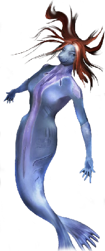

Selkies are similar to aquanauts with heavy splices of seal traits. Their legs are fused into a pair of hind flippers for powerful swimming. On land, they can stand but have difficulty moving, as they must flop, roll, or hop like a seal, but they are sometimes sleeved in micrograv habs. They are adapted for the lack of air, deep cold, and crushing pressure of subcrustal oceans.

<blockquote class="indent stat-list">

### Selkie

- **Cost:** 3&nbsp;MP • **Avail:** 20 (70 in aquatic habs)

---

- **WT:** 8 • **DUR:** 40 • **DR:** 60
- **Insight** 0, **Moxie** 0, **Vigor** 2, **Flex** 2

---

- **Movement Rate:** Swim 4/20, Walker 4/12
- **Ware:** Biomods, Cortical Stack, Cryogenic Protection, Enhanced Respiration, Gills, Mesh Inserts, Pressure Adaptation, Sonar, Swim Bladder
- **Morph Traits:** Exotic Morphology (Level 2), Non-Human Biochemistry (Level 2)
- **Common Extras:** Enhanced Hearing, Enhanced Vision, Oxygen Reserve, Toxin Filters

</blockquote>

## Splicer

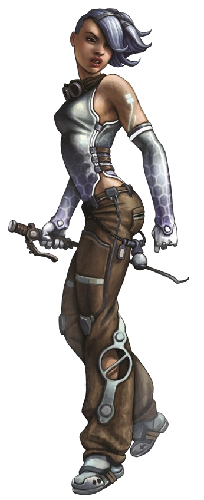

Splicers are genefixed humans. Their genome cleansed of hereditary diseases and optimized for looks and health, but not otherwise substantially upgraded. Splicers make up the majority of transhumanity.

<blockquote class="indent stat-list">

### Splicer

- **Cost:** 1&nbsp;MP • **Avail:** 90

---

- **WT:** 6 • **DUR:** 30 • **DR:** 45
- **Insight** 0, **Moxie** 0, **Vigor** 0, **Flex** 1

---

- **Movement Rate:** Walker 4/20
- **Ware:** Biomods, Cortical Stack, Mesh Inserts

</blockquote>

## Surya

Despite the extreme temperatures of the solar corona, the plasma in that part of the sun’s atmosphere is incredibly diffuse, meaning actual heat transfer is quite low, making it survivable with the right protections. Suryas blur the line between biomorph and synthmorph and push the envelope of synthetic biology in order to survive in this hostile environment. Named for a Hindu sun deity, suryas reach lengths of ten meters or more and rely heavily on both whale and extremophile genetics. Their skin is a metamaterial that provides an almost perfect reflection of the sun’s spectral output and enables radiative cooling. They “surf ” the solar winds using powerful magnetic fields that also shield from radiation, plasma, and heat. Strong bones and connective tissues protect against the crushing solar gravity while medichines repair tissue damaged by radiation and convert hydrogen ions into water. Surya rely on lasers and chromatophore signaling using wavelengths not flooded by the sun’s emissions to communicate.

A lateral line organ allows them to “hear” the low-frequency vibrations that resonate through the corona’s plasma, which is both useful for limited “whale song” short-range communication and helpful for predicting and avoiding flares and other solar weather.

<blockquote class="indent stat-list">

### Surya

- **Cost:** 9&nbsp;MP • **Avail:** 5 (30 at Sol)

---

- **WT:** 12 • **DUR:** 60 • **DR:** 90
- **Insight** 0, **Moxie** 0, **Vigor** 1, **Flex** 3

---

- **Movement Rate:** Magnetic Generator 8/40, Swim 8/40
- **Ware:** Anti-Glare, Asymmetric Sleep, Biomods, Chameleon Skin, Cortical Stack, Enhanced Hearing, Enhanced Vision, Heat Tolerance, Laser Link (Medium), Long-Term Life Support, Magnetic Generator, Medichines, Mesh Inserts, Oxygen Reserve, Refractive Coating, Vacuum Sealing
- **Morph Traits:** Exotic Morphology (Level 3), Non-Human Biochemistry (Level 2)

</blockquote>

### Nishakara Variant

Nishakara, named after the Hindu “night maker” lunar deity who sprang from the sea, are the generic non-coronal “space whale” variants of surya. Similar to ring flyers, they soar the solar winds and electromagnetic fields of large planetary systems.

<blockquote class="indent stat-list">

### Nishakara

- **Cost:** 6&nbsp;MP • **Avail:** 5 (20 at Saturn)

---

- **WT:** 12 • **DUR:** 60 • **DR:** 90
- **Insight** 0, **Moxie** 0, **Vigor** 1, **Flex** 2

---

- **Movement Rate:** Magnetic Generator 8/40, Swim 8/40
- **Ware:** Biomods, Cortical Stack, Cryogenic Protection, Enhanced Vision, Long-Term Life Support, Magnetic Generator, Medichines, Mesh Inserts, Oxygen Reserve, Vacuum Sealing
- **Morph Traits:** Exotic Morphology (Level 3), Non-Human Biochemistry (Level 2)
- **Common Extras:** Hibernation. Many have the Enhanced Behavior (Introversion, Level 2) trait.

</blockquote>

## Sylph

Sylph morphs are ideal for media icons, elite socialites, XP stars, models, and narcissists. Sylph gene sequences are tailored for distinctive good looks, ethereal and elfin features, and slim and lithe bodies. Their metabolism has also been sanitized to eliminate unpleasant bodily odors and their pheromones adjusted for universal appeal.

<blockquote class="indent stat-list">

### Sylph

- **Cost:** 4&nbsp;MP • **Avail:** 60

---

- **WT:** 6 • **DUR:** 30 • **DR:** 45
- **Insight** 1, **Moxie** 3, **Vigor** 1, **Flex** 1

---

- **Movement Rate:** Walker 4/20
- **Ware:** Biomods, Clean Metabolism, Cortical Stack, Enhanced Pheromones, Mesh Inserts
- **Common Extras:** Many have the Striking Looks trait.

</blockquote>

## Theseus

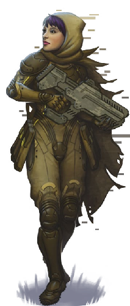

Theseus morphs are designed to protect against the dangers of biohazards and hostile environments, from alien worlds to TITAN quarantine zones to habitats lost during the Fall. They are favored by scavengers, gatecrashers, zone stalkers, and specialists investigating exsurgent or TITAN activity.

<blockquote class="indent stat-list">

### Theseus

- **Cost:** 7&nbsp;MP • **Avail:** 20 (40 at gate habs)

---

- **WT:** 7 • **DUR:** 35 • **DR:** 53
- **Insight** 1, **Moxie** 3, **Vigor** 1, **Flex** 0

---

- **Movement Rate:** Walker 4/20
- **Ware:** Biomods, Cortical Stack, Emergency Farcaster, Medichines, Mesh Inserts, Nanophages, Oxygen Reserve, Stress Control, Toxin Filters, Vacuum Sealing
- **Common Extras:** Bioweave, Cold Tolerance, Enhanced Vision, Failsafe, Radiation Sense, Respirocytes, T-Ray Emitter

</blockquote>

