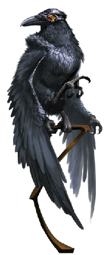
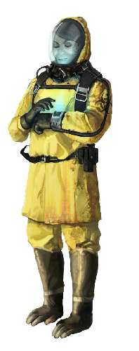
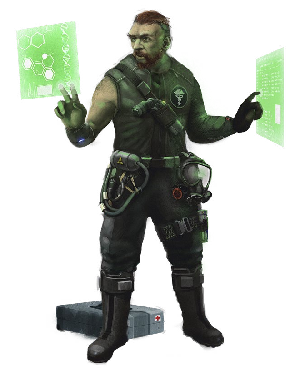
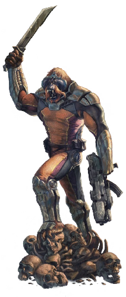
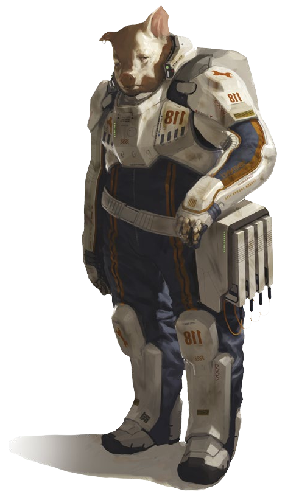
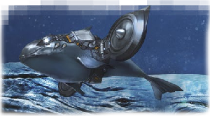

# Uplift Biomorphs

## Neo-Avian

Neo-avians include ravens, crows, and gray parrots uplifted to human-level intelligence. Their physical sizes are much larger than their non-uplifted cousins (to the size of a human child), with larger heads for their increased brain size. Numerous transgenic modifications have been made to their wings, allowing them to retain limited flight capabilities at 1&nbsp;g, but giving them a more bat-like physiology so they can bend and fold better and adding primitive digits for basic tool manipulation. Their toes are also more articulated and now accompanied with an opposable thumb. Neo-avians have adapted well to microgravity environments, and are favored for their small size and reduced resource use.

<blockquote class="indent stat-list">

### Neo-Avian

- **Cost:** 0&nbsp;MP • **Avail:** 50

---

- **WT:** 5 • **DUR:** 25 • **DR:** 38
- **Insight** 2, **Moxie** 1, **Vigor** 0, **Flex** 0

---

- **Movement Rate:** Walker 2/8, Winged 8/40
- **Ware:** Biomods, Claws, Cortical Stack, Direction Sense, Enhanced Vision, Mesh Inserts, Prehensile Feet, Wings
- **Morph Traits:** Exotic Morphology (Level 3), Non-Human Biochemistry (Level 2)
- **Notes:** Beak/Claw Attack (DV 2d6), Small size

</blockquote>

## Neo-Beluga

Neo-belugas are the smallest and most numerous of the surviving whale uplifts, ranging from 3 to 5.5 meters in length. They are white-skinned with no dorsal ridge, toothed, and have the distinction of being the only whales that can swim backwards. They can safely descend to about 1,000 meters at 1&nbsp;g; deeper requires the pressure adaptation mod.

<blockquote class="indent stat-list">

### Neo-Beluga

- **Cost:** 3&nbsp;MP • **Avail:** 10 (30 in aquatic habs)

---

- **WT:** 9 • **DUR:** 45 • **DR:** 68
- **Insight** 1, **Moxie** 1, **Vigor** 1, **Flex** 1

---

- **Movement Rate:** Swim 4/20
- **Ware:** Asymmetric Sleep, Biomods, Cold Tolerance, Cortical Stack, Enhanced Hearing, Enhanced Respiration, Gills, Mesh Inserts, Sonar
- **Morph Traits:** Exotic Morphology (Level 2), Lack of Manipulators, Lack of Smell, Non-Human Biochemistry (Level 1)
- **Common Extras:** Cyberarms, Extra Limbs
- **Notes:** Large size

</blockquote>

## Neo-Bonobo/Neo-Chimp

Like other neo-hominids, uplifted bonobo and chimpanzee morphs feature enhanced intelligence and bipedal frames. Their long arms and prehensile feet are a boon for climbing and maneuvering in microgravity environments. They retain the body hair of their forebears, though it is a common cultural practice to dye, stylize, or otherwise manipulate it. Transgenic vocal systems allow them to speak as humans do.

<blockquote class="indent stat-list">

### Neo-Bonobo/Neo-Chimp

- **Cost:** 1&nbsp;MP • **Avail:** 50

---

- **WT:** 6 • **DUR:** 30 • **DR:** 45
- **Insight** 0, **Moxie** 2, **Vigor** 1, **Flex** 0

---

- **Movement Rate:** Walker 4/12
- **Ware:** Biomods, Cortical Stack, Enhanced Smell, Mesh Inserts, Prehensile Feet
- **Morph Traits:** Exotic Morphology (Level 1) Non-Human Biochemistry (Level 1)

</blockquote>

## Neo-Dolphin

Dolphin uplifts are very physiologically similar to baseline dolphins. Most range in size from 2 to 4 meters. They are torpedo-shaped fast swimmers, with conical teeth, long snouts, and blow holes. They can safely dive to about 1,000 meters at 1&nbsp;g.

<blockquote class="indent stat-list">

### Neo-Dolphin

- **Cost:** 2&nbsp;MP • **Avail:** 10 (50 in aquatic habs)

---

- **WT:** 8 • **DUR:** 40 • **DR:** 60
- **Insight** 0, **Moxie** 1, **Vigor** 1, **Flex** 1

---

- **Movement Rate:** Swim 8/40
- **Ware:** Asymmetric Sleep, Biomods, Cold Tolerance, Cortical Stack, Enhanced Hearing, Enhanced Respiration, Gills, Mesh Inserts, Sonar
- **Morph Traits:** Exotic Morphology (Level 2), Lack of Manipulators, Lack of Smell, Non-Human Biochemistry (Level 1)
- **Common Extras:** Cyberarms, Extra Limbs
- **Notes:** Large size

</blockquote>

## Neo-Gorilla

Neo-gorillas benefit from enhanced cognition and upright stances like other neo-hominids, though they are not as adept at climbing. They stand roughly as tall as humans and have stronger and larger frames.

<blockquote class="indent stat-list">

### Neo-Gorilla

- **Cost:** 3&nbsp;MP • **Avail:** 40

---

- **WT:** 9 • **DUR:** 45 • **DR:** 68
- **Insight** 0, **Moxie** 0, **Vigor** 3, **Flex** 1

---

- **Movement Rate:** Walker 4/12
- **Ware:** Biomods, Cortical Stack, Enhanced Smell, Mesh Inserts, Prehensile Feet
- **Morph Traits:** Exotic Morphology (Level 1), Non-Human Biochemistry (Level 1)

</blockquote>

## Neo-Neanderthal

This morph is derived from fossilized Neanderthal DNA, uplifted and enhanced to transhuman equivalence. Neanderthal morphs appear muscular with a heavy bone structure, distinctively long skulls, heavy brow ridges, and weak chins. Pale complexions and red hair are common features.

<blockquote class="indent stat-list">

### Neo-Neanderthal

- **Cost:** 2&nbsp;MP • **Avail:** 35

---

- **WT:** 7 • **DUR:** 35 • **DR:** 53
- **Insight** 0, **Moxie** 1, **Vigor** 2, **Flex** 1

---

- **Movement Rate:** Walker 4/20
- **Ware:** Biomods, Cortical Stack, Mesh Inserts
- **Morph Traits:** Non-Human Biochemistry (Level 1)

</blockquote>

## Neo-Octopus

Colloquially known as “octomorphs,” these uplifted octopus sleeves are quite useful in zero-gravity environments. They retain eight arms, their chameleon ability to change skin color, ink sacs, and a sharp beak. They also have increased brain mass and longevity, can breathe both air and water, and lack a skeletal structure so they can squeeze through tight spaces. Octomorphs typically crawl along in zero gravity using their arm suckers and expelling air for propulsion; in low gravity they walk on two of their arms. Their eyes have been enhanced with color vision, provide a 360-degree field of vision, and rotationally adjust to keep the slitshaped pupil aligned with “up.” A transgenic vocal system allows them to speak.

<blockquote class="indent stat-list">

### Neo-Octopus

- **Cost:** 3&nbsp;MP • **Avail:** 35

---

- **WT:** 6 • **DUR:** 30 • **DR:** 45
- **Insight** 1, **Moxie** 1, **Vigor** 1, **Flex** 2

---

- **Movement Rate:** Swim 4/20, Thrust Vector (Gas Jet) 4/12, Walker 2/8
- **Ware:** 360-Degree Vision, Biomods, Chameleon Skin, Cortical Stack, Gills, Mesh Inserts, Polarization Vision
- **Morph Traits:** Exotic Morphology (Level 3), Limberness (Level 2), Non-Human Biochemistry (Level 2)
- **Notes:** 8 prehensile arms, Beak Attack (DV 1d10), Ink Attack (use Athletics, blinding, 5-meter uniform area-effect in water and micrograv)

</blockquote>

## Neo-Orangutan

Neo-orangutans have the same uplifted features as their neo-hominid cousins. Compared to humans, their legs are shorter and arms longer. Neo-orangutans tend to be more solitary than social.

<blockquote class="indent stat-list">

### Neo-Orangutan

- **Cost:** 3&nbsp;MP • **Avail:** 35

---

- **WT:** 7 • **DUR:** 35 • **DR:** 53
- **Insight** 1, **Moxie** 1, **Vigor** 2, **Flex** 0

---

- **Movement Rate:** Walker 4/12
- **Ware:** Biomods, Cortical Stack, Enhanced Smell, Mesh Inserts, Prehensile Feet
- **Morph Traits:** Exotic Morphology (Level 1), Limberness (Level 1), Non-Human Biochemistry (Level 1)
- **Notes:** Reach (+10)

</blockquote>

## Neo-Orca

Though colloquially referred to as killer whales, orcas are actually members of the dolphin family. They range from 5 to 8 meters in length, have distinct black-andwhite coloration, and bit with powerful jaws. Males also have larger and more triangular pectoral fins. They can safely dive to about 1,000 meters at 1&nbsp;g.

<blockquote class="indent stat-list">

### Neo-Orca

- **Cost:** 4&nbsp;MP • **Avail:** 10 (30 in aquatic habs)

---

- **WT:** 10 • **DUR:** 50 • **DR:** 75
- **Insight** 1, **Moxie** 0, **Vigor** 3, **Flex** 1

---

- **Movement Rate:** Swim 8/40
- **Ware:** Asymmetric Sleep, Biomods, Cold Tolerance, Cortical Stack, Enhanced Hearing, Enhanced Respiration, Gills, Mesh Inserts, Sonar
- **Morph Traits:** Exotic Morphology (Level 3), Lack of Manipulators, Lack of Smell, Non-Human Biochemistry (Level 1)
- **Common Extras:** Cyberarms, Extra Limbs
- **Notes:** Very Large size, Bite Attack (DV 3d10 +5)

</blockquote>

## Neo-Pig

Uplifted pig morphs are bipedal and feature transgenic hands, feet, and vocal systems. They tend to be slightly shorter than the average transhuman but much stockier. Males grow tusks from their lower jaws.

<blockquote class="indent stat-list">

### Neo-Pig

- **Cost:** 1&nbsp;MP • **Avail:** 30

---

- **WT:** 7 • **DUR:** 35 • **DR:** 53
- **Insight** 0, **Moxie** 1, **Vigor** 1, **Flex** 1

---

- **Movement Rate:** Walker 4/20
- **Ware:** Biomods, Cortical Stack, Mesh Inserts
- **Morph Traits:** Exotic Morphology (Level 1), Non-Human Biochemistry (Level 1)
- **Common Extras:** Many have the Impaired Balance trait.

</blockquote>

## Neo-Porpoise

Neo-porpoises are smaller but very similar to neo-dolphins, with blunter snouts, and are much like their baseline relatives. They range from 1.5 to 2.5 meters in length. They can safely dive to about 1,000 meters at 1&nbsp;g.

<blockquote class="indent stat-list">

### Neo-Porpoise

- **Cost:** 1&nbsp;MP • **Avail:** 10 (50 in aquatic habs)

---

- **WT:** 7 • **DUR:** 35 • **DR:** 53
- **Insight** 0, **Moxie** 1, **Vigor** 1, **Flex** 0

---

- **Movement Rate:** Swim 8/40
- **Ware:** Asymmetric Sleep, Biomods, Cold Tolerance, Cortical Stack, Enhanced Hearing, Enhanced Respiration, Gills, Mesh Inserts, Sonar
- **Morph Traits:** Exotic Morphology (Level 2), Lack of Manipulators, Lack of Smell, Non-Human Biochemistry (Level 1)
- **Common Extras:** Cyberarms, Extra Limbs
- **Notes:** Some are Large size

</blockquote>

## Neo-Whale

Less than several hundred neo-whale morphs exist, and the majority remain occupied by their original egos. They are primarily found on Ceres and Atlantica. They are derived from humpback, blue, and sperm whale genetic stock. Humpbacks and blues are baleen whales and require large amounts of krill to survive. Sperm whales are toothed, feeding on fish and squid. They can safely dive to about 3,000 meters at 1&nbsp;g.

<blockquote class="indent stat-list">

### Neo-Whale

- **Cost:** 5&nbsp;MP • **Avail:** 5 (10 in aquatic habs)

---

- **WT:** 12 • **DUR:** 60 • **DR:** 90
- **Insight** 1, **Moxie** 2, **Vigor** 2, **Flex** 2

---

- **Movement Rate:** Swim 8/40
- **Ware:** Asymmetric Sleep, Biomods, Cold Tolerance, Cortical Stack, Enhanced Hearing, Enhanced Respiration, Gills, Mesh Inserts, Sonar
- **Morph Traits:** Exotic Morphology (Level 3), Lack of Manipulators, Lack of Smell, Non-Human Biochemistry (Level 1)
- **Common Extras:** Cyberarms, Extra Limbs
- **Notes:** Very Large size, Bite Attack (DV 4d10 +5)

</blockquote>

