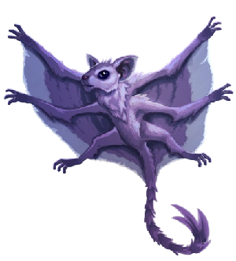
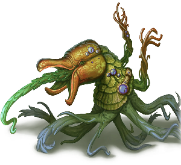

# Exomorph Biomorphs

## Scurrier

Scurriers are developed from sciurids, a non-sapient extraterrestrial species similar to hexapod, raccoon-sized flying squirrels. Cute and colorful, they are also extremely fast and agile. They make excellent climbers, gliders, and tunnel workers.

<blockquote class="indent stat-list">

### Scurrier

- **Cost:** 2&nbsp;MP • **Avail:** 30 (40 in gate habs)

---

- **WT:** 5 • **DUR:** 25 • **DR:** 38
- **Insight** 0, **Moxie** 2, **Vigor** 2, **Flex** 0

---

- **Movement Rate:** Walker 4/20
- **Ware:** Access Jacks, Biomods, Cortical Stack, Cyberbrain, Enhanced Hearing, Extra Limbs (1 pair), Gliding Membrane, Grip Pads, Mesh Inserts, Mnemonics, Prehensile Tail, Puppet Sock
- **Morph Traits:** Exotic Morphology (Level 3), Limberness (Level 1), Non-Human Biochemistry (Level 2)
- **Common Extras:** Claws, Enhanced Smell, Enhanced Vision, Prehensile Feet
- **Notes:** 6 limbs, Small size

</blockquote>

### Quadruped Variant

This four-limbed version of the scurrier is easier to adapt to.

<blockquote class="indent stat-list">

### Quadruped Scurrier

- **Cost:** 2&nbsp;MP • **Avail:** 30 (40 in gate habs)

---

- **WT:** 5 • **DUR:** 25 • **DR:** 38
- **Insight** 0, **Moxie** 2, **Vigor** 2, **Flex** 0

---

- **Movement Rate:** Walker 4/20
- **Ware:** Access Jacks, Biomods, Cortical Stack, Cyberbrain, Enhanced Hearing, Gliding Membrane, Grip Pads, Mesh Inserts, Mnemonics, Prehensile Tail, Puppet Sock
- **Morph Traits:** Exotic Morphology (Level 2), Non-Human Biochemistry (Level 2)
- **Notes:** Small size

</blockquote>

## Whiplash

Designed by autonomist xenobotanists, these pods are bio-engineered from the predatory whiplash creatures found on the exoplanet Sunrise, with additional transgenic features. The primary modification made to the original creature was to turn the entire organism upside down and orient the digestive portion of the organism horizontally, so that the whiplash’s tri-lobed orifice faces forward. The whiplash’s grasping roots were also converted into even more motile “walking tentacles.” Other adjustments include the addition of a pair of grasping limbs, each with four universally opposable digits; artificial sensing mods (providing transhuman-standard sensing ability); and a general toughening of the internal structure for rigidity and support. The ability to extend and retract the whiplash’s feeding tendril was heavily enhanced, so now the tendril acts more like a two-meter-long chameleon-like tongue than a hanging food-trap.

Although whiplash morphs are unusual even by transhuman standards, they are gaining traction among gatecrashers working in arboreal environments.

<blockquote class="indent stat-list">

### Whiplash

- **Cost:** 2&nbsp;MP • **Avail:** 10 (30 in gate habs)

---

- **WT:** 8 • **DUR:** 40 • **DR:** 60
- **Insight** 0, **Moxie** 0, **Vigor** 1, **Flex** 2

---

- **Movement Rate:** Walker 4/12
- **Ware:** Access Jacks, Biomods, Chameleon Skin, Cortical Stack, Cyberbrain, Grasping Tendril, Mesh Inserts, Mnemonics, Puppet Sock
- **Morph Traits:** Exotic Morphology (Level 3), Non-Human Biochemistry (Level 2)
- **Notes:** Beak/Claw Attack (DV 2d6)

</blockquote>

